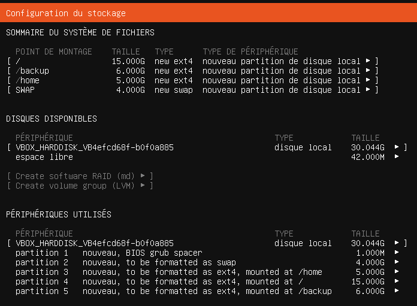
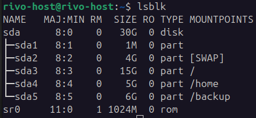
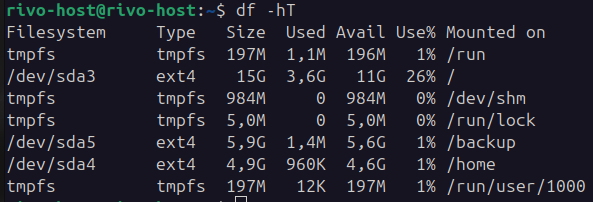
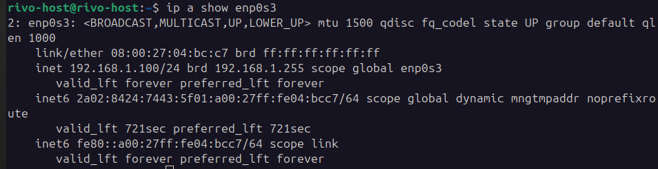
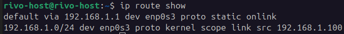
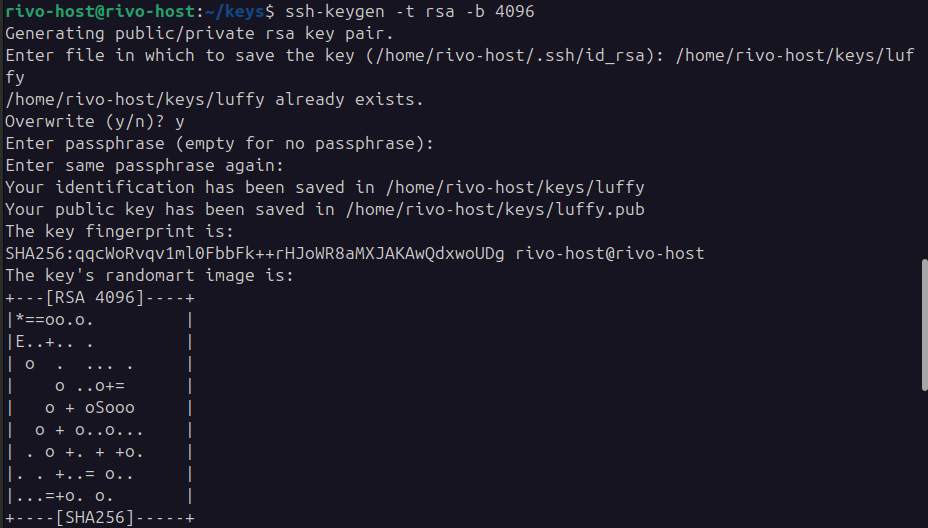
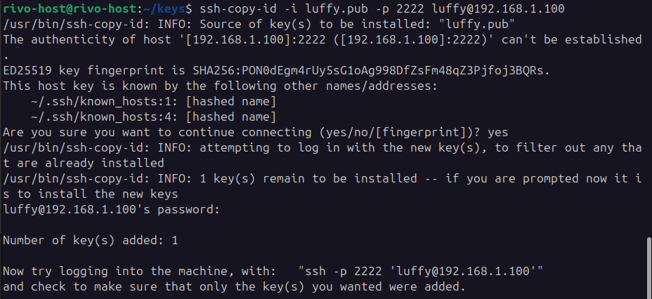

# UBUNTU SERVER

## Introduction
Ce projet vise à mettre en place et administrer un serveur Ubuntu en configurant divers aspects tels que la sécurité, le réseau, la gestion des utilisateurs, et l'installation de services populaires comme un serveur FTP, MySQL, et WordPress.

## Configuration de la Machine Virtuelle

- **Installation** : Ubuntu Server LTS installé comme machine virtuelle.
- **Taille du disque** : 30 Go divisé en partitions :
  - `swap` : 4 Go
  - `/` : 15 Go
  - `/home` : 5 Go
  - `/backup` : 6 Go



`Commandes` pours  valider les partitions:




- **Nom d'hôte** : Configuré au format `rivo-host`.

## Configuration Réseau
- **Adresse IP statique** : Configurée avec un masque de sous-réseau choisi.

1. Pour cela on configure le netplan:

```yaml
network:
  version: 2
  renderer: networkd
  ethernets:
    enp0s3:
      dhcp4: no
      dhcp6: no 
      addresses:
        - 192.168.1.100/24
      nameservers:
        addresses:
          - 8.8.8.8
          - 1.1.1.1
          - 9.9.9.9
      routes:
        - to: 0.0.0.0/0
          via: 192.168.1.1
          on-link: true
      optional: true
```

De suite on applique ```sudo netplan apply```

2. Vérification de l'absence de DCHP
 


3. Vérification de la passerelle



4. Tester internet
      
        ping -4 google.com

## Sécurité

1. Le compte root ne doit pas être utilisé pour l'administration

        sudo whoami
        root

2. Interdire la connexion SSH en root

Dans /etc/ssh/sshd_config: `PermitRootLogin no`

3. Changer le port SSH en 2222

Dans /etc/ssh/sshd_config: `Port 2222`

4. Configurer UFW (firewall)

    sudo ufw default deny incoming
    sudo ufw default allow outgoing
    sudo ufw allow 2222/tcp   # Pour SSH
    sudo ufw allow 80/tcp     # Pour HTTP (WordPress)
    sudo ufw allow 21/tcp     # Pour FTP

## Gestion des Utilisateurs
- **Utilisateur `luffy` et mdp : `mugiwara`** 

1. Créer l'utilisateur avec home

  `sudo adduser --home /home/luffy luffy`

2. Ajouter aux sudoers :

  `sudo usermod -aG sudo luffy`

3. Créer sa clé privé et publique `luffy` et `luffy.pub` et autoriser la clé publique

  * `ssh-keygen -t rsa -b 4096`


  * `ssh-copy-id `


4. Dans /etc/ssh/sshd_config:

        PasswordAuthentication no
        PubkeyAuthentication yes

        Match User luffy
            PasswordAuthentication no
            PubkeyAuthentication yes


- **Utilisateur `zoro`et mdp : `dono`**

1. Créer l’utilisateur avec home dans /home/zoro :

`sudo adduser --home /home/zoro zoro`

2. Dans /etc/ssh/sshd_config:
  
        Match User zoro
            PasswordAuthentication yes

## Services

### Objectif
Installer un serveur FTP et créer un utilisateur `nami` avec accès uniquement en lecture sur `/backup`.

---

### Configuration réalisée

- Serveur FTP installé : **vsftpd**
- Utilisateur FTP créé : `nami`
- Mot de passe : *mot de passe personnalisé utilisé pour l’audit*
- Répertoire accessible : `/backup`
- Accès : **lecture seule** (read-only)
- Accès anonyme : **désactivé** (anonymous access disabled)

---

## Commandes et vérifications

### Création `nami`
`sudo adduser nami`

`sudo chown root:root /backup`

Change le propriétaire du dossier /backup pour qu’il appartienne à l’utilisateur root et au groupe root. Cela garantit que seul root est propriétaire du dossier. Personne d’autre ne pourra modifier les permissions sans privilèges root.

`sudo chmod a-w /backup`

Retire les droits d’écriture (-w) à tous les utilisateurs (a) : propriétaire, groupe et autres. Le dossier devient lecture/accès seulement (pas modifiable, sauf si on remet les droits). Même root devra réactiver l’écriture s’il veut modifier le contenu, sauf s’il force (sudo).

#### Changer le dossier personnel de nami vers /backup

`sudo usermod -d /backup nami`

Et empêche-le de sortir de ce dossier en chroot :

`sudo nano /etc/vsftpd.conf`

Modifie / ajoute ces lignes :

    listen=YES
    anonymous_enable=NO
    local_enable=YES
    write_enable=NO
    chroot_local_user=YES
    allow_writeable_chroot=NO
    user_sub_token=$USER
    local_root=/backup

## Base de Données
## Objectif
- Installer MySQL Server.
- Désactiver la connexion distante pour l’utilisateur root.
- Empêcher toute connexion à MySQL depuis l’extérieur du serveur.
- Créer un utilisateur MySQL spécifique avec uniquement les droits nécessaires sur la base WordPress.
- Ne pas utiliser l’utilisateur root dans la configuration WordPress.

---

### Configuration réalisée

- **MySQL Server installé** avec la version la plus récente stable.
- **Connexion distante root désactivée** :  
  L’utilisateur root ne peut se connecter qu’en local (`localhost`).
- **Accès MySQL restreint** uniquement à partir du serveur local :  
  MySQL n’écoute que sur `127.0.0.1` / socket Unix.
- **Utilisateur MySQL créé :**
  - Nom : `wp_user`
  - Mot de passe : *Wordpress12345!* (exemple)
  - Permissions :  
    - Sélection, insertion, mise à jour, suppression uniquement sur la base `wordpress_db`.
    - Pas de privilèges d’administration globale.
- **WordPress configuré** pour utiliser uniquement l’utilisateur `wp_user` dans `wp-config.php`.

---

### Commandes principales utilisées

-- Création utilisateur restreint

`CREATE USER 'wp_user'@'localhost' IDENTIFIED BY 'Wordpress12345!';`

-- Attribution des droits limités sur la base WordPress

`GRANT SELECT, INSERT, UPDATE, DELETE ON wordpress_db.* TO 'wp_user'@'localhost';`

-- Suppression de l’accès root distant

`UPDATE mysql.user SET Host='localhost' WHERE User='root';
FLUSH PRIVILEGES;`


- **MySQL Server** : Installé avec accès root local uniquement et utilisateur dédié pour WordPress.

Édite le fichier :
sudo nano /etc/mysql/mysql.conf.d/mysqld.cnf

Vérifie que cette ligne est bien :
bind-address = 127.0.0.1

sudo mysql
CREATE DATABASE wordpress_db;
CREATE USER 'wp_user'@'localhost' IDENTIFIED BY 'Wordpress12345!';
GRANT ALL PRIVILEGES ON wordpress_db.* TO 'wp_user'@'localhost';
FLUSH PRIVILEGES;
EXIT;
## WordPress
- **Installation** : 
  * WordPress a été installé dans le répertoire racine du serveur web :
`/var/www/html/`

  * L’archive officielle a été téléchargée, extraite et correctement positionnée dans `/var/www/html`.
Les permissions ont été ajustées pour `www-data`.

- **Configuration** : 
  * Le fichier wp-config.php a été créé à partir de wp-config-sample.php.

  * Les paramètres suivants ont été configurés dans wp-config.php :

      define( 'DB_NAME', 'wordpress_db' );
      define( 'DB_USER', 'wp_user' );
      define( 'DB_PASSWORD', 'Wordpress12345!' );
      define( 'DB_HOST', 'localhost' );

 * Le fichier wp-config.php n’est pas accessible publiquement via le navigateur :
      
      http://{host}/wp-config.php → Forbidden / Not Found

Cela a été vérifié pour des raisons de sécurité.


## Sauvegardes
### Objectif

Mettre en place un système de sauvegarde automatisé de la base de données WordPress afin de se protéger contre :

  * Erreurs humaines
  * Pannes matérielles
  * Attaques de virus
  * Coupures de courant
  * Sinistres divers

### SCRIPT
```bash

#!/bin/bash

# Variables
DB_NAME="wordpress_db"
DATE=$(date +'%Y-%m-%d_%H-%M')
SQL_FILE="/tmp/wp_db_backup_${DATE}.sql"
TAR_FILE="/backup/wp_db_backup_${DATE}.tar.gz"
LOG_FILE="/var/log/backup.log"

# Dump via .my.cnf (wp_user configuré)
mysqldump "$DB_NAME" > "$SQL_FILE"

# Si la sauvegarde fonctionne
if [ $? -eq 0 ]; then
    tar -czf "$TAR_FILE" "$SQL_FILE"
    rm "$SQL_FILE"
    echo "$(date +'%F %T') - Backup successful: $(basename "$TAR_FILE")" >> "$LOG_FILE"
else
    echo "$(date +'%F %T') - Backup failed!" >> "$LOG_FILE"
fi

```

### Configuration de la sauvegarde
***Tâche planifiée (Cron)***

* Un cron job est configuré pour s’exécuter tous les jours à 00:00.
* Il lance un script de sauvegarde situé dans :
`/usr/local/bin/backup.sh`

***Sécurité : Gestion des informations sensibles***
* Un fichier de configuration ~/.my.cnf a été créé pour éviter de stocker les identifiants en clair dans le script.

***Exemple du contenu de /root/.my.cnf :***
```ini
[client]
user=wp_user
password=Wordpress12345!
```

* Ce fichier est lu automatiquement par les commandes mysqldump, mysql, etc., si le script est exécuté par le même utilisateur (ici root via cron ou sudo).
* mysqldump lit les options dans l’ordre suivant :

    1. /etc/my.cnf

    2. /etc/mysql/my.cnf

    3. ~/.my.cnf ← utilisé ici

Le script n’a donc plus besoin d’indiquer les paramètres -u et -p.

### Cron job
Un cron job a été ajouté à la crontab root pour exécuter le script chaque jour à 00:00 :

  `0 0 * * * /usr/local/bin/backup.sh`

### Fichiers générés

* Les fichiers de sauvegarde sont enregistrés dans le répertoire /backup
* Le nom du fichier respecte le format suivant :

      wp_db_backup_YYYY-MM-DD_HH-MM.tar.gz

Exemple :

      wp_db_backup_2025-07-23_00-00.tar.gz

### Accès FTP
  * Utilisateur FTP : nami
  * Accès limité à : /backup (lecture seule)
  * Accès FTP anonyme : désactivé


# Bonus Part
If you complete the mandatory part perfectly, you can move to this part. You can add anything you feel deserves to be a bonus, some of the suggested ideas:

Install the Minecraft server, It must be always running even if you reboot your server.

Automate all instructions with ansible, so you can remake this long process in more than 1 server in a short time.

Set up the SSL in the web server and FTP server, you can use self-signed SSL.

Challenge yourself!
